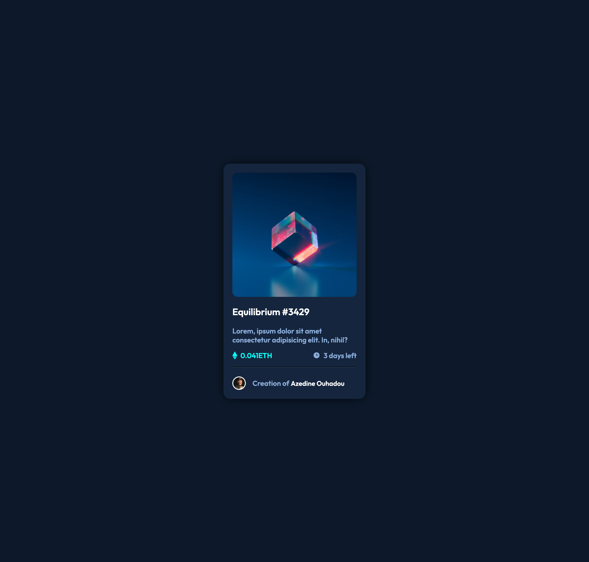

# Frontend Mentor - NFT preview card component solution

This is a solution to the [NFT preview card component challenge on Frontend Mentor](https://www.frontendmentor.io/challenges/nft-preview-card-component-SbdUL_w0U). Frontend Mentor challenges help you improve your coding skills by building realistic projects. 

## Table of contents

- [Overview](#overview)
  - [The challenge](#the-challenge)
  - [Screenshot](#screenshot)
  - [Links](#links)
- [My process](#my-process)
  - [Built with](#built-with)
  - [What I learned](#what-i-learned)
  - [Continued development](#continued-development)
  - [Useful resources](#useful-resources)
- [Author](#author)
- [Acknowledgments](#acknowledgments)

## Overview

### The challenge

Users should be able to:

- View the optimal layout depending on their device's screen size
- See hover states for interactive elements

### Screenshot

### Links

- Solution URL: [Add solution URL here](https://your-solution-url.com)
- Live Site URL: [Add live site URL here](https://your-live-site-url.com)

## My process

- create div container
- create div for card inside compenent 
- create div for image inside card
- create div for text-box below div image
- create div for both eth and clock inside text-box
- create div for profile
- custom code using css and make it responsive using flexbox 

### Built with

- Semantic HTML5 markup
- CSS custom properties
- Flexbox

### What I learned

In this Exercice I learned How To implement the basic html5 And Css3 stuff, And how to use Flexbox properties, also i learn how to make hover for my project.

### Continued development

In Future Projects, I will focus to use the max of what I learned early, and trying to do my best in each code section to make it more clean and efficient.

### Useful resources

- [w3s](https://www.w3schools.com/) - This helped me for learning basic stuff for both html and css.
- [css-tricks](https://css-tricks.com/snippets/css/a-guide-to-flexbox/) - This is an amazing article which helped me finally understand Felexbox focusing on all the different possible properties.

## Author

- Website - [Azedine Ouhadou](https://github.com/Xperaz)
- Frontend Mentor - [@Xperaz](https://www.frontendmentor.io/profile/Xperaz)
- Twitter - [@OuhadouAzedine](https://www.twitter.com/OuhadouAzedine)

## Acknowledgments

I will recomend css-tricks flexbox This is an amazing article which helped me finally understand Felexbox and use it to solve this project.
